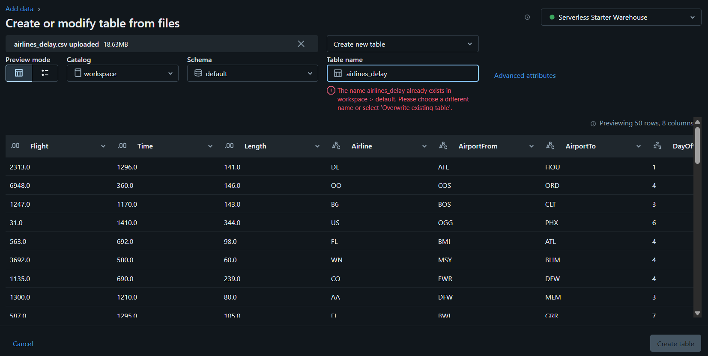
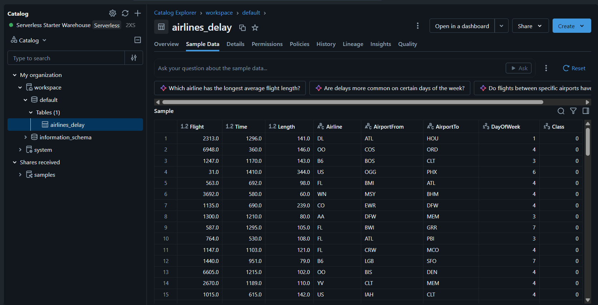
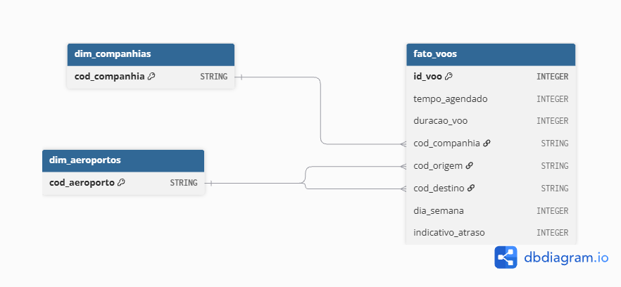
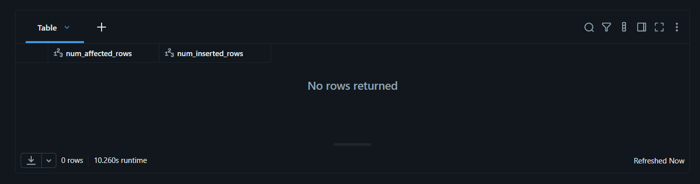
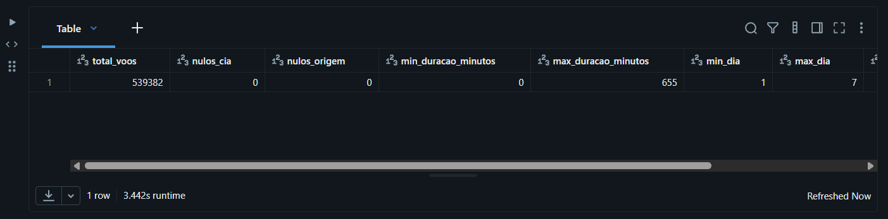
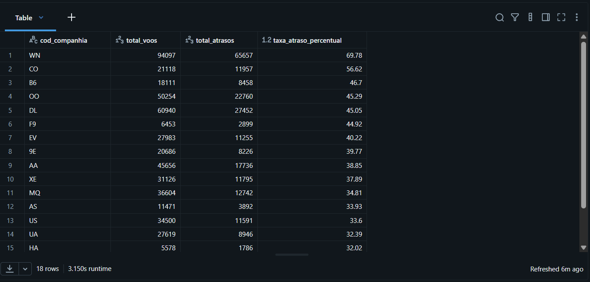
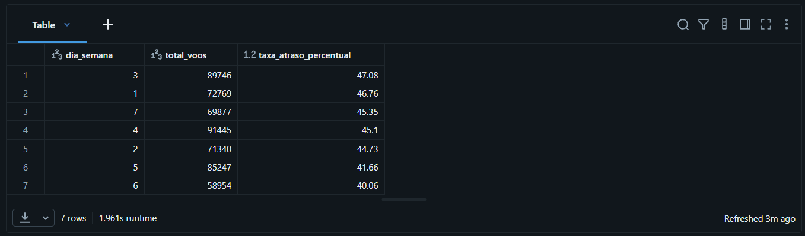
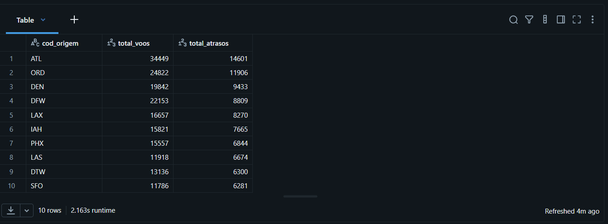
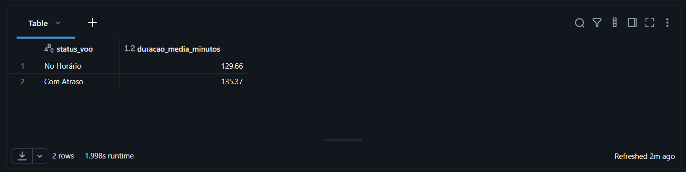

# MVP - Pipeline de Engenharia de Dados na Nuvem

Este repositório contém a entrega do Minimum Viable Product (MVP) para a disciplina de Engenharia de Dados da PUC-Rio. O projeto demonstra a construção de um pipeline de dados de ponta a ponta utilizando o Databricks Free Edition e a Arquitetura Medalhão.

---

### 1. Contexto de Negócios e Perguntas (Etapa 2 e 4.1)

**Contexto de Negócios:**
O setor de aviação comercial lida com margens de lucro estreitas e alta sensibilidade à satisfação do cliente. Atrasos em voos geram um efeito cascata: perda de ligações, custos com multas e remarcações, além da insatisfação sistémica dos passageiros. O objetivo deste projeto de Engenharia de Dados é construir um pipeline que processe dados históricos de voos para identificar padrões de atraso. Com estes dados limpos e modelados, áreas de inteligência de negócios (BI) e operações poderão planear melhor a alocação de frota, ajustar cronogramas e prever estrangulamentos logísticos[cite: 9].

**Perguntas de Negócio:**

1. Quais companhias aéreas apresentam a maior e a menor taxa histórica de atrasos?
2. Existe um padrão de dias da semana em que os atrasos são mais frequentes e severos?
3. Quais aeroportos de origem concentram o maior volume absoluto de voos atrasados?
4. A duração prevista do voo possui correlação com a ocorrência de atrasos?

**Fonte e Contexto dos Dados Brutos:**
Os dados foram extraídos da plataforma Kaggle (Dataset: _Airlines Delay_). A base de dados original consiste num ficheiro de formato CSV contendo registos de voos comerciais. A estrutura bruta possui colunas essenciais como identificação da companhia aérea (`Airline`), aeroportos de origem e destino (`AirportFrom`, `AirportTo`), dia da semana (`DayOfWeek`), tempo do voo (`Length`) e a variável alvo indicando se houve atraso (`Delay` ou `Class`).

**Licença de Uso:**
A base de dados possui licença aberta disponível no Kaggle (uso livre para fins académicos e educacionais), garantindo que os dados podem ser manipulados e publicados neste portfólio sem restrições de direitos autorais[cite: 9].

---

### 2. Carga dos Dados (Etapa 4.2)

A carga inicial dos dados foi realizada adotando o conceito da **Camada Bronze** da Arquitetura Medalhão[cite: 9]. O ficheiro bruto em formato `.csv` extraído do Kaggle foi ingerido no Databricks Free Edition por meio da interface de importação de ficheiros (Data Ingestion/Catalog). Os dados foram persistidos na tabela denominada `airlines_delay`, sem qualquer tipagem forçada ou alteração de estrutura, garantindo a preservação histórica do dado na sua origem.

**Evidências da Carga (Camada Bronze):**

_Figura 1: Importação do ficheiro bruto para o Databricks._

_Figura 2: Tabela `airlines_delay` disponível no Unity Catalog._

---

### 3. Modelagem e Catálogo de Dados (Etapa 4.3)

Para otimizar as consultas analíticas e seguir as melhores práticas de Data Warehousing no ambiente Lakehouse, optou-se por estruturar as camadas Silver e Gold utilizando a modelagem **Esquema Estrela (Star Schema)**[cite: 9]. O modelo é composto por duas Tabelas Dimensão (`dim_companhias` e `dim_aeroportos`) para armazenar as entidades únicas, e uma Tabela Fato (`fato_voos`) que centraliza os eventos transacionais.

#### Catálogo de Dados

**Tabela: `dim_companhias`** (Camada Gold)
_Contexto: Armazena os códigos únicos das companhias aéreas operantes._

| Campo           | Descrição                          | Tipo de Dado | Domínio de Valores             | Linhagem                                                                        |
| :-------------- | :--------------------------------- | :----------- | :----------------------------- | :------------------------------------------------------------------------------ |
| `cod_companhia` | Código identificador da companhia. | STRING       | Textos curtos (ex: 'DL', 'AA') | Extraído e deduplicado da coluna `Airline` da tabela `airlines_delay` (Bronze). |

**Tabela: `dim_aeroportos`** (Camada Gold)
_Contexto: Armazena os códigos únicos de todos os aeroportos listados na base._

| Campo           | Descrição                          | Tipo de Dado | Domínio de Valores      | Linhagem                                                                              |
| :-------------- | :--------------------------------- | :----------- | :---------------------- | :------------------------------------------------------------------------------------ |
| `cod_aeroporto` | Código identificador do aeroporto. | STRING       | Siglas IATA de 3 letras | União deduplicada das colunas `AirportFrom` e `AirportTo` da tabela `airlines_delay`. |

**Tabela: `fato_voos`** (Camada Gold)
_Contexto: Registo central de cada voo com as suas chaves estrangeiras e a variável categórica de atraso._

| Campo               | Descrição                                   | Tipo de Dado | Domínio de Valores        | Linhagem                                                      |
| :------------------ | :------------------------------------------ | :----------- | :------------------------ | :------------------------------------------------------------ |
| `id_voo`            | Identificador sequencial/lógico do voo.     | INTEGER      | Valores numéricos > 0     | Convertido da coluna `Flight` da tabela `airlines_delay`.     |
| `tempo_agendado`    | Horário de partida programado (em minutos). | INTEGER      | 1 a 1439 (minutos em 24h) | Convertido da coluna `Time` da tabela `airlines_delay`.       |
| `duracao_voo`       | Duração total prevista do voo em minutos.   | INTEGER      | Numéricos > 0             | Convertido da coluna `Length` da tabela `airlines_delay`.     |
| `cod_companhia`     | Chave estrangeira da companhia aérea.       | STRING       | Textos curtos (ex: 'DL')  | Renomeado da coluna `Airline` da tabela `airlines_delay`.     |
| `cod_origem`        | Chave estrangeira do aeroporto de partida.  | STRING       | Siglas IATA de 3 letras   | Renomeado da coluna `AirportFrom` da tabela `airlines_delay`. |
| `cod_destino`       | Chave estrangeira do aeroporto de chegada.  | STRING       | Siglas IATA de 3 letras   | Renomeado da coluna `AirportTo` da tabela `airlines_delay`.   |
| `dia_semana`        | Dia da semana em que o voo ocorreu.         | INTEGER      | 1 a 7 (1=Seg, 7=Dom)      | Convertido da coluna `DayOfWeek` da tabela `airlines_delay`.  |
| `indicativo_atraso` | Flag binária indicando atraso severo.       | INTEGER      | 0 (No Delay) ou 1 (Delay) | Convertido da coluna `Class` da tabela `airlines_delay`.      |

---

### 4. Pipeline de Dados (Etapa 4.4)

O pipeline de ETL (Extração, Transformação e Carga) foi desenvolvido de forma centralizada num único _notebook_ no ambiente Databricks, utilizando a linguagem SQL[cite: 9]. O processo extrai os dados brutos da tabela `airlines_delay` e realiza as seguintes transformações estruturais:

1. **Deduplicação:** Criação das dimensões utilizando a cláusula `DISTINCT` para garantir a unicidade das chaves primárias e `UNION` para unificar os códigos de origem e destino.
2. **Tipagem e Relacionamento:** Criação da `fato_voos`, onde os dados originais sofreram conversão explícita de tipos (`CAST`) para garantir a integridade analítica.

**Evidência da Execução do Pipeline:**

_Figura 3: Execução bem-sucedida do script SQL de modelagem no Databricks._

---

### 5. Qualidade de Dados (Etapa 4.5)

Para garantir a fiabilidade das análises, uma varredura de qualidade foi executada na `fato_voos`[cite: 9]:

- **Completude:** A base demonstrou excelente saúde. Não foram encontrados valores nulos (`NULL`) nas chaves estrangeiras (`cod_companhia` e `cod_origem`) num universo de 539.382 registos.
- **Consistência (Anomalia Detetada):** Ao avaliar os limites numéricos, identificou-se uma grave inconsistência na coluna `duracao_voo`. O valor máximo foi de 655 minutos, porém o valor mínimo registado foi de **0 minutos**.
- **Tratamento Adotado:** Um voo com duração zero é uma impossibilidade física. Para que este _outlier_ não distorça as médias, foi adicionado um filtro `WHERE duracao_voo > 0` nas consultas de negócio subsequentes, limpando o ruído sem apagar o dado da camada Gold[cite: 9].

**Evidência da Verificação de Qualidade:**

_Figura 4: Consulta evidenciando zero nulos e a deteção de voos com duração de 0 minutos._

---

### 6. Análise de Dados (Etapa 4.5)

As quatro perguntas de negócio foram respondidas utilizando consultas SQL sobre a camada Gold[cite: 9].

**1. Quais companhias aéreas apresentam a maior e a menor taxa histórica de atrasos?**
A companhia **WN** (Southwest Airlines) lidera isoladamente com a pior taxa, registando **69,78%** de atrasos. Em contraste, a **HA** (Hawaiian Airlines) demonstrou operações muito mais consistentes, com apenas **32,02%** de atrasos.

**2. Existe um padrão de dias da semana em que os atrasos são mais frequentes e severos?**
Sim. O meio da semana apresenta maiores desafios logísticos. O **dia 3 (quarta-feira)** registou a maior taxa de atrasos proporcionais (**47,08%**). Por outro lado, o **dia 6 (sábado)** revelou ser o dia mais seguro para viajar (**40,06%**), coincidindo com o menor volume absoluto de voos.

**3. Quais aeroportos de origem concentram o maior volume absoluto de voos atrasados?**
Os maiores estrangulamentos encontram-se nos grandes _hubs_. O aeroporto de **ATL** (Atlanta) lidera com **14.601 voos atrasados**, seguido por ORD (Chicago) com 11.906 e DEN (Denver) com 9.433.

**4. A duração prevista do voo possui correlação com a ocorrência de atrasos?**
A correlação é marginalmente positiva. Voos que sofreram atrasos possuíam uma duração média prevista de **135,37 minutos**, enquanto os voos pontuais tinham uma média de **129,66 minutos**. Rotas mais longas estão ligeiramente mais suscetíveis a atrasos.

---

### 7. Autoavaliação

O desenvolvimento deste MVP permitiu consolidar a visão de ponta a ponta de um pipeline num ambiente de nuvem real (Databricks)[cite: 9].

**Objetivos Atingidos:**
Foi possível orquestrar com sucesso a extração, ingestão (Bronze) e transformação dos dados mediante a aplicação da Arquitetura Medalhão (Esquema Estrela nas camadas Silver/Gold)[cite: 9]. As perguntas de negócio traçadas na fase inicial foram todas respondidas, evidenciando o valor da modelagem de dados para a tomada de decisão.

**Dificuldades Encontradas:**
O principal desafio ocorreu na etapa de Qualidade de Dados. Ao auditar a tabela fato, detetou-se uma anomalia em que a duração de alguns voos estava registada como "0 minutos". A resolução exigiu uma decisão arquitetural: em vez de apagar fisicamente o dado e perder a rastreabilidade, optou-se por aplicar filtros lógicos (`WHERE duracao_voo > 0`) nas consultas finais, garantindo a integridade analítica sem corromper a evidência bruta[cite: 9].

**Trabalhos Futuros:**
Para evoluir este MVP num portfólio profissional mais robusto, os próximos passos incluiriam:

1. **Enriquecimento de Dados:** Integrar uma API de dados meteorológicos históricos para cruzar informações de tempestades com os atrasos nos aeroportos.
2. **Orquestração:** Implementar o agendamento de _workflows_ no Databricks para automatizar a ingestão de dados numa frequência diária.
3. **Visualização:** Ligar a tabela Gold final a uma ferramenta de _Business Intelligence_ (como o Power BI) para construir _dashboards_ interativos.
